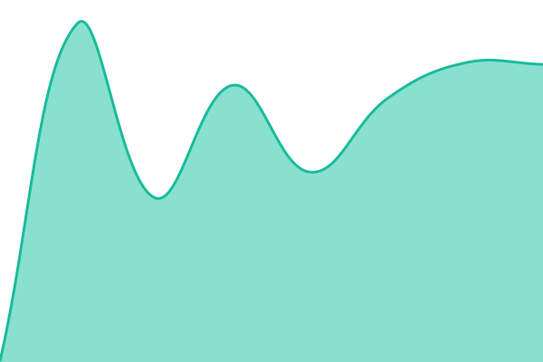

# [📈 실시간 상태](https://status.qanote.app): <!--live status--> **모든 시스템 정상 운영 중**

This repository contains the open-source uptime monitor and status page for [Songwook Han](https://status.qanote.app), powered by [Upptime](https://github.com/upptime/upptime).

With [Upptime](https://upptime.js.org), you can get your own unlimited and free uptime monitor and status page, powered entirely by a GitHub repository. We use [Issues](https://github.com/coolwithyou/qanote-status/issues) as incident reports, [Actions](https://github.com/coolwithyou/qanote-status/actions) as uptime monitors, and [Pages](https://status.qanote.app) for the status page.

## [📈 Live Status](https://demo.upptime.js.org): <!--live status--> **모든 시스템 정상 운영 중**

<!--start: status pages-->
<!-- This summary is generated by Upptime (https://github.com/upptime/upptime) -->
<!-- Do not edit this manually, your changes will be overwritten -->
<!-- prettier-ignore -->
| URL | Status | History | Response Time | Uptime |
| --- | ------ | ------- | ------------- | ------ |
|  [QA Note Web](https://qanote.app) | 🟩 Up | [qa-note-web.yml](https://github.com/coolwithyou/qanote-status/commits/HEAD/history/qa-note-web.yml) | 

 1421ms
     
 | 

<a href="https://status.qanote.app/history/qa-note-web">100.00%</a>
    

|  [QA Note API](https://qanote.app/api/health) | 🟩 Up | [qa-note-api.yml](https://github.com/coolwithyou/qanote-status/commits/HEAD/history/qa-note-api.yml) | 

 350ms
     
 | 

<a href="https://status.qanote.app/history/qa-note-api">100.00%</a>
    

|  [QA Note Extension API](https://qanote.app/api/extension/health) | 🟩 Up | [qa-note-extension-api.yml](https://github.com/coolwithyou/qanote-status/commits/HEAD/history/qa-note-extension-api.yml) | 

 374ms
     
 | 

<a href="https://status.qanote.app/history/qa-note-extension-api">100.00%</a>
    

|  [QA Note MCP](https://qanote.app/api/mcp/health) | 🟩 Up | [qa-note-mcp.yml](https://github.com/coolwithyou/qanote-status/commits/HEAD/history/qa-note-mcp.yml) | 

 444ms
     
 | 

<a href="https://status.qanote.app/history/qa-note-mcp">100.00%</a>
    

<!--end: status pages-->

[**Visit our status website →**](https://status.qanote.app)

## 📄 License

- Powered by: [Upptime](https://github.com/upptime/upptime)
- Code: [MIT](./LICENSE) © [Anand Chowdhary](https://anandchowdhary.com)
- Data in the `./history` directory: [Open Database License](https://opendatacommons.org/licenses/odbl/1-0/)
